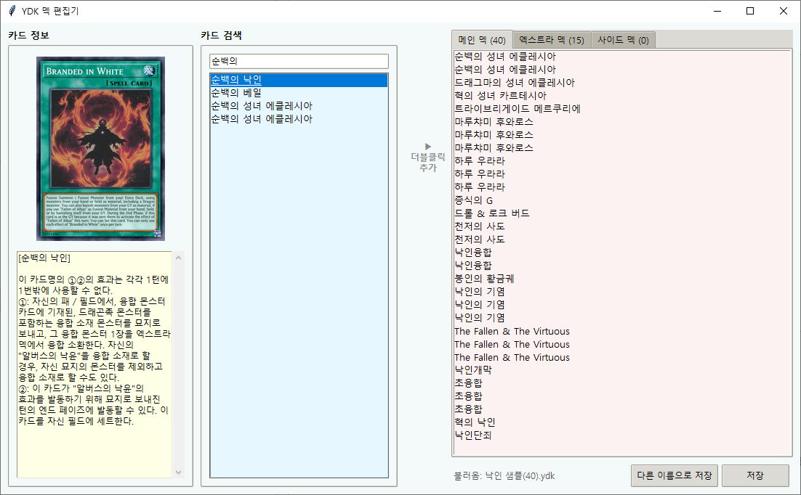
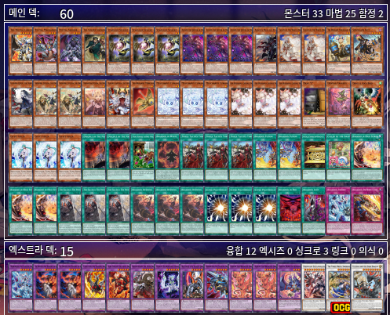

# 개요


패 5장을 입력받아 원핸드 또는 투핸드 파츠를 감지하고, 가장 최적의 전개 방법과 리플레이를 추천해주는 프로그램입니다.

## 주요 기능
- **YDK 파일 연동 및 편집:** 본인의 덱 레시피(.ydk)를 기반으로 덱에 실제로 존재하는 카드로만 전개를 추천합니다. 또한 YDK 파일을 편집할 수 있습니다. 
- **클립보드 스크린샷 인식:** 인게임 패 이미지를 복사(Ctrl+V)하는 것만으로 카드를 자동 식별합니다.
- **전개 및 리플레이 제공:** 조건에 맞는 전개법 리스트와 시각적인 리플레이 링크를 제공합니다.

## 설치 및 준비 사항
본 프로그램은 **Python 3** 환경에서 동작합니다. 실행 전 필요한 외부 라이브러리를 설치해주세요.

### 필수 라이브러리 설치
- opencv-python (cv2): 캡처한 패 영역의 이미지를 SIFT 알고리즘으로 분석하고 특징점을 추출하여 카드를 식별하는 핵심 컴퓨터 비전 라이브러리입니다.
- numpy (numpy): 이미지 데이터를 고속으로 연산하고, 윈도우 환경의 '한글 경로명 인식 오류'를 우회하여 이미지를 디코딩하는 데 사용됩니다.
- Pillow (PIL): 클립보드에 복사된 이미지를 가져오고(ImageGrab), 추천 결과창에서 카드 썸네일 이미지를 GUI에 맞게 리사이징하여 띄워주는 그래픽 처리 라이브러리입니다.

CMD 창을 열고 아래 명령어를 입력해주세요
``` bash
pip install opencv-python numpy pillow
```

# 사용법
0. branded_combo_gui_tk.py를 엽니다(버전은 매번 수정될 수도 있음) 
1. YDK 찾기 버튼을 눌러, ydk파일 형식으로 저장된 본인의 덱 레시피를 등록합니다.(샘플 덱을 사용해도 됩니다. 샘플 덱은 하단 참조) 
2. 인 게임(마스터 듀얼, YGOPRO 등)에서 캡처 도구(`Win + Shift + S`)를 사용하여 전체 화면 또는 내 패 5장이 있는 하단 영역을 드래그해 캡처합니다.
3. 스크린샷을 프로그램에 ctrl+V 하여 붙여넣습니다. 혹은 `클립보드 인식` 버튼을 누릅니다.
4. 만약 캡쳐를 할 수 없는 상황이거나, 제대로 작동하지 않는다면 직접 패 상황을 입력하셔도 됩니다. 
5. **전개 추천 실행** 버튼을 누릅니다. 
6. 추천된 전개 리스트 중 하나를 선택하여 전개법을 확인하고, 리플레이 링크를 복사하여 플레이를 참고합니다.

# 미리보는 QnA

**Q.** 저는 덱에 `더 비스테드 루벨리온` 같은 카드를 넣지 않았는데, 관련 전개법이 뜨나요?

**A.** 아닙니다. ydk에 투입된 카드를 확인하고 전개법을 추천해줍니다.

---

**Q.** 덱에 1장만 넣은 `트라이브리게이드 메르쿠리에`가 패에 잡혔는데, 이미 패에 `봉인의 황금궤`가 잡혔다면 `봉인의 황금궤` 관련 전개 방법이 나오나요?

**A.** 아뇨, 덱에 있어야만 카드가 있는 전개법이 있다면, 그 전개법은 노출되지 않습니다. 

---

# 샘플 덱



본인이 쓰는 덱 레시피이며, 각각 40축과 60축 샘플 덱입니다.
첨부된 덱은 어디까지나 샘플 레시피이므로 우측 상단에 위치한 덱 편집기로 자유롭게 편집하시면 됩니다. 

# 부족한 점
공개된 전개 시트를 기반으로 제작되어, 모든 전개를 다루고 있지 않기 때문에 부족한 부분이 존재합니다. 
일부 투핸드 전개법 및 신규 지원 이전의 전개 방법은 아직 추가되지 않았습니다. 
틈틈히 수정해나갈 수 있지만, 업데이트가 오래 이루어지지 않을 수도 있습니다. 
수작업으로 JSON 파일을 작업하기에, 일부 오타 및 버그가 존재할 수 있습니다. 

# 출처
모든 전개 방법은 아래 스프레드 시트에서 가져왔음을 알립니다. 과거에 작성된 시트이기 때문에 현재로는 가짓수도, 전개도 조금 부족할 수 있지만 많은 양질의 자료를 담고있기 때문에 사용했습니다. 
* [낙인 전개 스프레드시트 링크](https://docs.google.com/spreadsheets/d/1wAd11bAIHfDxNm4xgZsI5XTuI_iaBx3CoWjVRN3LirY/edit?gid=1654946768#gid=1654946768)
이미지 자료 및 cdb 자료는 EDOPro의 것을 사용했습니다. 
