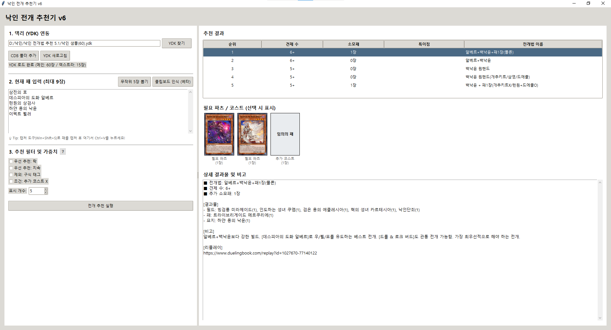
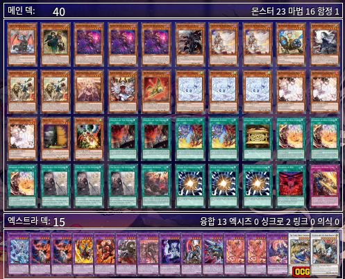

# 개요

패 5장을 입력받은 뒤, 그 중 원핸드 파츠를 감지하여 전개 방법을 추천하는 프로그램

# 사용법
1. 인게임 스크린샷을 찍는다.
2. 스크린샷을 프로그램에 ctrlV한다.
3. 전개 추천 실행을 한다.
4. 뜨는 전개 추천 리스트 중 하나를 선택하고, 리플레이 링크를 확인한다.
5. 링크를 복사하여 감상하고, 그대로 따라한다. 

# 샘플 덱

본인이 쓰는 덱 레시피, 낙인 샘플2.ypk 샘플 덱입니다.
어디까지나 샘플이므로, ygopro및 edopro에서 자유롭게 수정하고 사용하면 됩니다. 

# 출처
모든 전개 방법은 아래 스프레드 시트에서 가져왔음을 알립니다. 과거에 작성된 시트이기 때문에 현재로는 가짓수도, 전개도 조금 부족할 수 있지만 많은 양질의 자료를 담고있기 때문에 사용했습니다. 
https://docs.google.com/spreadsheets/d/1wAd11bAIHfDxNm4xgZsI5XTuI_iaBx3CoWjVRN3LirY/edit?gid=1005629851#gid=1005629851
